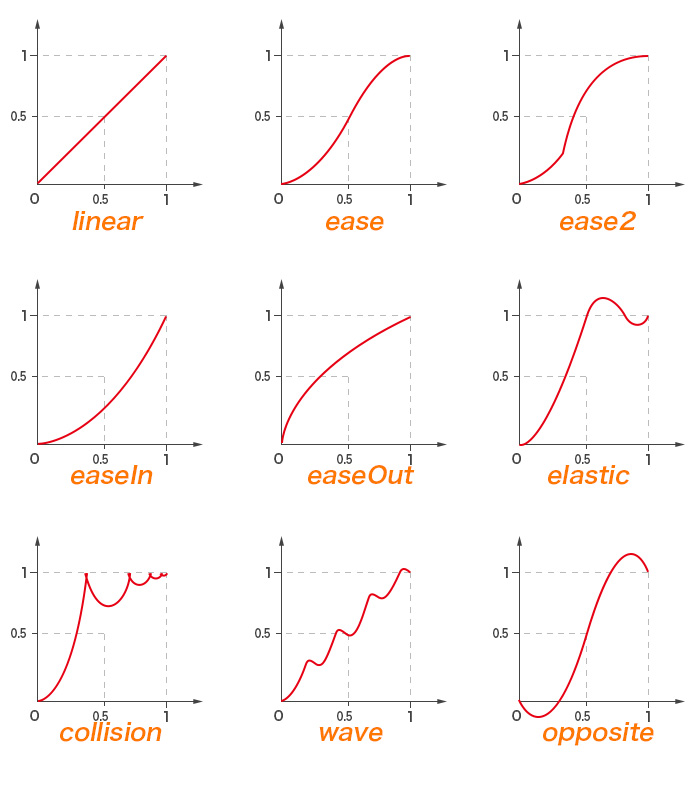

# move.js

Simple and powerful javascript transition library, you can use it to achieve DOM or canvas animation, or any other number transitions you want


### Features
* Extending customized transition curves
* Compitable with IE8(ES3)
* Compitable with `CommonJS`, `AMD` and `browser`
* Using `requestAnimationFrame` first

<p align="center">
  
</p>


[demo](https://flfwzgl.github.io/move/test/demo.html)

### api
* linear
* ease
* ease2
* easeIn
* easeOut
* elastic
* collision
* wave
* opposite

### Installation
``` bash
npm i -S transition-move
```
or
``` html
<script src="move.js"></script>
```

### Usage
``` javascript
move.collision([from, to], time, callback, fnEnd);
```

#### Examples
``` javascript
// move a box
var box = document.getElementsById('box');
move.collision([0, 1000], 500, function (x) {
  box.style.left = x + 'px';
}, function () {
  alert('over!');
});

// stop move 100ms later
setTimeout(_ => {
  stop();
}, 100)
```


### Add new transition curves
``` javascript
move.extend({
  fast: function (x) {
    return x * x * x;
  }
});
```

Then you can use `move.fast([0, 1000], 500, x => box.style.left = x + 'px')` to animate elements;


### License
MIT


---


# move.js

简单但强大的js过渡函数库, 可以用来制作各种dom动画和canvas动画, 包含多种常用过渡曲线

### 特性
* 扩展自定义过渡曲线
* 兼容IE8
* 兼容 `CommonJS`, `AMD` 和 浏览器
* 优先使用 `requestAnimationFrame`, 低版本浏览器自动降级为 `setInterval`

### api
```
  linear ->     匀速运动
  ease ->       先加速后减速
  ease2 ->      先加速一小段距离, 然后突然大提速, 最后减速
  easeIn ->     初速度为0, 一直加速
  easeOut ->    初速度较大, 一直减速
  elastic ->    弹性动画(终点附近来回摆动)
  collision ->  碰撞动画
  wave ->       断断续续加速减速
  opposite ->   先反方向移动一小段,然后正向移动,超过终点一小段之后回到终点
```


### 安装
``` bash
npm i -S transition-move
```
或者
``` html
<script src="move.js"></script>
```

### 用法
``` javascript
move.collision([from, to], time, callback, fnEnd);
```

#### 例子
``` javascript
// 移动一个盒子
var box = document.getElementsById('box');
var stop = move.collision([0, 1000], 500, function (x) {
  box.style.left = x + 'px';
}, function () {
  alert('结束!');
});


// 100ms后中途停止移动;
setTimeout(_ => {
  stop();
}, 100)
```

**move.js** 其实是一个数字的过渡函数库, 必须传入 一个包含两个数字的数组(如```[0, 2000]```), 一个回调函数 **fn**, 它会使用对应的动画曲线从 0 过渡到 2000, 定时器每次会传入当前的过渡数字到 **fn** 中.  还可以选择性传入一各 **fnEnd**, 作为动画完成之后的执行函数.

用此过渡函数库可对任意包含数值的属性进行过渡, 不管是 `box-shadow, border` 还是 **SVG** 中 `path` 标签的 `d` 属性, 还是 **Canvas** 中的过渡, 做起来都非常简单


#### 添加新动画
move.js 可以很方便地添加新动画, 操作如下:
```javascript
move.extend({
  fast: function (x) {
    return x * x * x;
  }
})
```
上面传入的```fast```函数是一个动画曲线函数, 调用时会自动传入一个自变量```x```, 范围在```0```到```1```, 返回的值y的值域也最好在```0```到```1```, 如果动画结束, 会强行设置```y```为```1```.

然后就可以欢快地使用 `move.fast([from, to], function(){ ... })` 开始啪啪啪了......

### 许可协议
MIT


